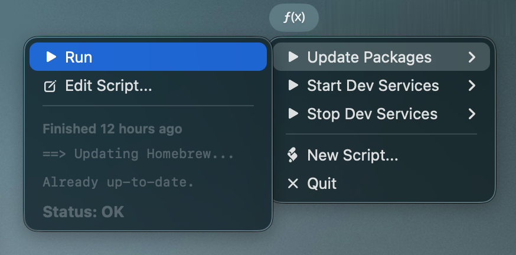
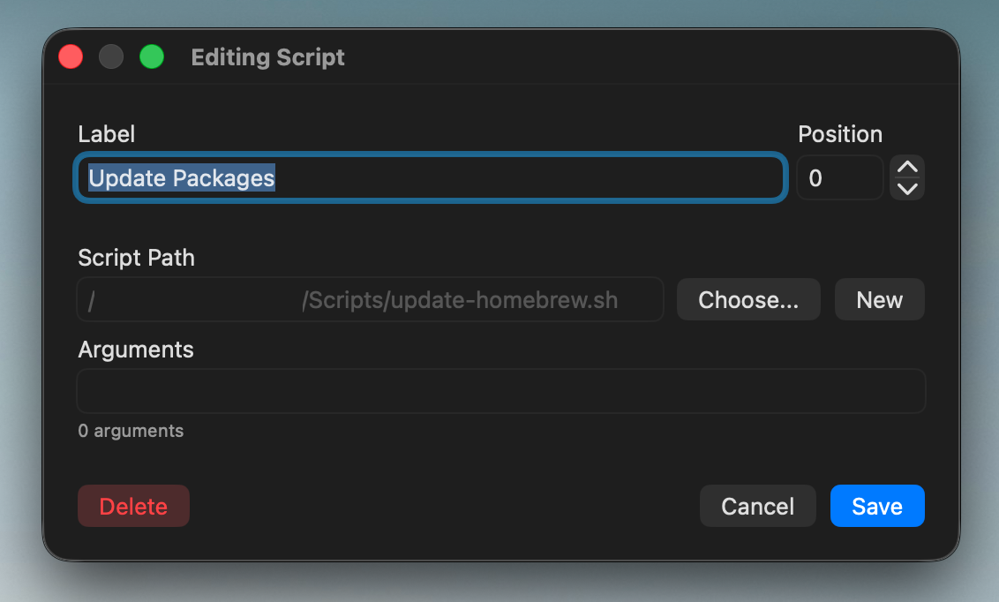

# EzMenu

A very simple script runner that lives in your menu bar.

## Planned Features

My goal with this app is to reduce the amount of things I have to open a rogue terminal to do. Aside from that, there are many macOS apps that are glorified command-line wrappers who want to charge you a subscription for access. I want to get rid of those - straight up.

- [x] Show trailing output of script's last run
- [x] Allow reordering of scripts
- [x] Script argument parsing
- [ ] Context aware scripts
    - This would show only scripts relevant to your foreground app.
- [ ] Custom icons per script
- [ ] Allow script grouping (via submenus or sections)
- [ ] Dynamic arguments
    - This would allow input of a selected file or clipboard contents, to allow for more dynamic scripts (e.g. zip/unzip a tar, shrink a video with ffmpeg, etc.)
